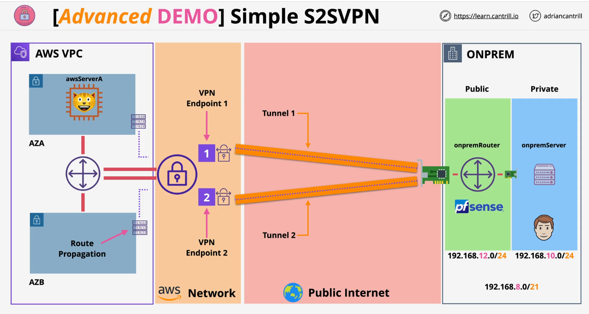
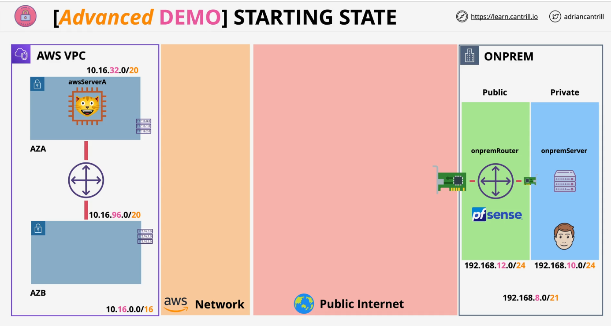
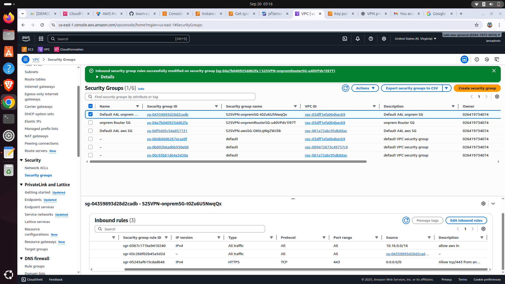

# 🌐 Site-to-Site VPN (AWS ↔ On-Premises Simulation)

## 📝 Project Overview  
This project demonstrates how to establish a **Site-to-Site VPN (S2SVPN)** between an **AWS VPC** and a **simulated on-premises environment** using **pfSense**.  

The VPN ensures secure communication between private networks across the public internet. The AWS side is provisioned with **CloudFormation**, while the on-premises side is simulated with pfSense.  

---

## 🎯 Objectives
- Simulate an **on-premises environment** with pfSense (router/firewall) and a private server.  
- Deploy an **AWS VPC** (via CloudFormation) with public/private subnets and EC2 instances.  
- Configure **Customer Gateway** and **Virtual Private Gateway** in AWS.  
- Establish and test the **Site-to-Site VPN tunnel**.  
- Demonstrate secure cross-site connectivity.  

---

## 🏗️ Architecture  

### 🔹 Final VPN Architecture  
  

---

### 🔹 Starting State (Before VPN)  
  

---

## ⚙️ Deployment Steps  

### 1. **Deploy AWS VPC with CloudFormation**  
  
📝 CloudFormation automates infrastructure deployment, ensuring consistency and repeatability.  

---

### 2. **Configure Customer Gateway (CGW) in AWS**  
  

 

📝 Represents the on-premises pfSense router to AWS.  

---

### 3. **Create Virtual Private Gateway (VGW)**  
  
📝 AWS’s VPN endpoint, attached to the VPC.  

---

### 4. **Create VPN Connection**  
 

  
📝 Two IPsec tunnels automatically created for redundancy.  

---

### 5. **Configure pfSense (On-Premises Simulation)**  

📝 Imported AWS VPN config into pfSense and verified tunnels are up.  

---

### 6. **Routing & Security Group Configuration**  

- **AWS Route Table:** Propagated routes from VGW and allowed traffic to `192.168.8.0/21`.  
- **On-Prem pfSense Routing:** Configured route back to AWS `10.16.0.0/16`.  
- **AWS Security Group:** Allowed ICMP and SSH from `192.168.0.0/16`.  

  

  

  

📝 Proper routing and firewall configuration ensures that traffic can flow securely across the VPN tunnel.  

---

### 7. **Test Connectivity**  
  
📝 Successful ping confirms end-to-end connectivity between AWS and on-premises.  

---

## ✅ Results
- AWS and On-Premises simulated network securely connected.  
- Private resources accessible across environments.  
- Demonstrated enterprise-grade networking use case.  

---

## 🚀 Tools & Services Used
- **AWS Services:** VPC, EC2, CloudFormation, Customer Gateway, Virtual Private Gateway, Site-to-Site VPN  
- **On-Prem Simulation:** pfSense (router), Linux server  
- **Networking Tools:** IPsec, routing tables, ping, traceroute  

---

## 📚 Lessons Learned
- Site-to-Site VPNs securely extend private networks into AWS.  
- Routing and security group rules must be configured carefully to allow traffic.  
- AWS provides pre-generated VPN configuration files, simplifying setup.  
